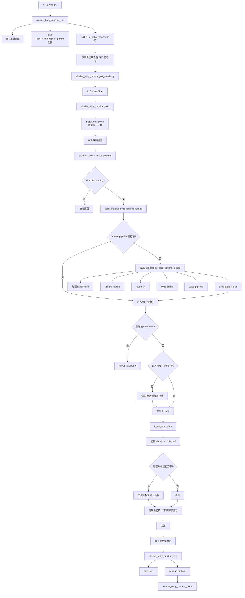

```mermaid
flowchart TD
    A[AI Service Init] --> B[alcidae_baby_monitor_init]
    B --> B1[读取通道配置]
    B --> B2[读取 license/so/model/cfg/param 配置]
    B --> B3[初始化 g_baby_monitor 状态]
    B3 --> C[按设备读取当前 BFC 灵敏度]
    C --> D[alcidae_baby_monitor_set_sensitivity]

    D --> E[AI Service Start]
    E --> F[alcidae_baby_monitor_start]
    F --> F1[仅置 running=true\n重置统计计数]
    F1 --> G[IVP 每帧回调]
    G --> H[alcidae_baby_monitor_process]

    H --> I{inited && running?}
    I -- 否 --> X1[直接返回]
    I -- 是 --> J[baby_monitor_sync_runtime_locked]

    J --> K{runtime/pipeline 已存在?}
    K -- 是 --> N[进入当前帧推理]
    K -- 否 --> L[baby_monitor_prepare_runtime_locked]
    L --> L1[加载 iiMulPro so]
    L --> L2[ensure license]
    L --> L3[report sn]
    L --> L4[MMZ probe]
    L --> L5[setup pipeline]
    L --> L6[alloc stage frame]
    L6 --> N

    N --> O{灵敏度 sens == 0?}
    O -- 是 --> O1[清框/记统计/返回]
    O -- 否 --> P{输入帧尺寸是否匹配?}

    P -- 否 --> P1[VGS 缩放到推理尺寸]
    P -- 是 --> Q[组装 II_IMG]

    P1 --> Q
    Q --> R[ii_src_push_data]
    R --> S[读取 alarm_buf / obj_buf]
    S --> T{是否命中遮面告警?}
    T -- 是 --> T1[节流上报告警 + 画框]
    T -- 否 --> T2[清框]

    T1 --> U[更新性能统计/首帧内存日志]
    T2 --> U
    U --> V[返回]

    V --> W[停止或反初始化]
    W --> W1[alcidae_baby_monitor_stop]
    W1 --> W2[clear rect]
    W1 --> W3[release runtime]
    W3 --> W4[alcidae_baby_monitor_deinit]
```